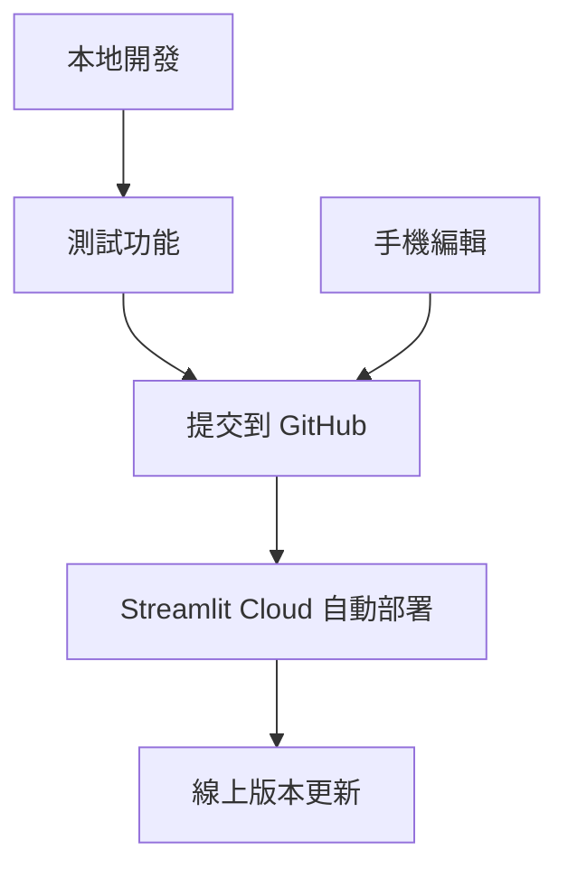

# 🔄 開發工作流程指南

## 📋 本地開發 + GitHub 同步方案

### **工作流程概覽**



### **優勢**
- ✅ **本地開發自由**：不受容量限制，可以處理大檔案
- ✅ **GitHub 備份**：程式碼安全備份和版本控制
- ✅ **自動部署**：Streamlit Cloud 自動更新線上版本
- ✅ **手機編輯**：可以從手機繼續開發
- ✅ **協作開發**：多人可以同時開發

## 🚀 開發步驟

### **1. 本地開發**

```bash
# 啟動本地開發環境
streamlit run main.py

# 在瀏覽器中測試功能
# http://localhost:8501
```

### **2. 測試功能**
- 測試所有新功能
- 確保沒有錯誤
- 檢查檔案大小（避免超過 GitHub 限制）

### **3. 同步到 GitHub**

```bash
# 檢查變更
git status

# 添加變更
git add .

# 提交變更
git commit -m "功能描述：新增群組化文件生成系統"

# 推送到 GitHub
git push origin main
```

### **4. 自動部署**
- GitHub 同步後，Streamlit Cloud 會自動重新部署
- 線上版本會自動更新：https://bei-da-pdf-comparison.streamlit.app

### **5. 手機編輯（可選）**
- 使用 GitHub 網頁版編輯檔案
- 或使用 Cursor Web 版本
- 變更會自動同步回本地

## 📁 檔案管理策略

### **同步到 GitHub 的檔案**
✅ **程式碼檔案**：
- `*.py` - Python 程式碼
- `*.toml` - 設定檔
- `*.txt` - 依賴檔案
- `*.md` - 文件檔案
- `.gitignore` - Git 忽略檔案
- `.gitattributes` - Git 屬性檔案

### **不同步到 GitHub 的檔案**
❌ **大檔案和本地檔案**：
- `venv/` - 虛擬環境
- `generated_files/` - 生成檔案
- `data/` - 本地資料
- `*.db` - 資料庫檔案
- `*.pdf`, `*.xlsx`, `*.png` - 大檔案

## 🔧 開發工具

### **本地開發**
- **IDE**：Cursor, VS Code, PyCharm
- **終端機**：PowerShell, CMD
- **瀏覽器**：Chrome, Firefox, Safari

### **手機編輯**
- **GitHub 網頁版**：https://github.com/sonic7527/File-comparison-system
- **Cursor Web**：https://cursor.sh
- **VS Code Web**：https://vscode.dev

## 📊 容量管理

### **GitHub 限制**
- **單一檔案**：最大 100MB
- **儲存庫大小**：建議不超過 1GB
- **免費帳戶**：無限制的公開儲存庫

### **容量優化**
1. **使用 .gitignore**：排除大檔案
2. **定期清理**：移除不必要的檔案
3. **使用 Git LFS**：處理大檔案（如果需要）

## 🚨 常見問題

### **Q: 檔案太大無法推送？**
A: 檢查 `.gitignore` 設定，確保大檔案被排除

### **Q: 線上版本沒有更新？**
A: 檢查 Streamlit Cloud 部署狀態，可能需要手動重新部署

### **Q: 手機編輯後如何同步？**
A: 在本地執行 `git pull origin main` 拉取最新變更

### **Q: 如何處理大檔案？**
A: 使用雲端儲存服務（Google Drive, OneDrive）儲存大檔案

## 📝 最佳實踐

### **提交訊息格式**
```
類型：簡短描述

詳細說明（可選）
```

**範例**：
```
feat: 新增群組化文件生成系統

- 支援基本資料群組管理
- 支援範本群組管理
- 支援A4格式自動轉換
- 支援圖片轉文件功能
```

### **定期備份**
- 每週同步到 GitHub
- 重要功能完成後立即同步
- 定期檢查線上版本狀態

### **測試策略**
- 本地測試所有功能
- 推送前確保沒有錯誤
- 部署後測試線上版本

---

**最後更新**：2024年
**版本**：v3.0 